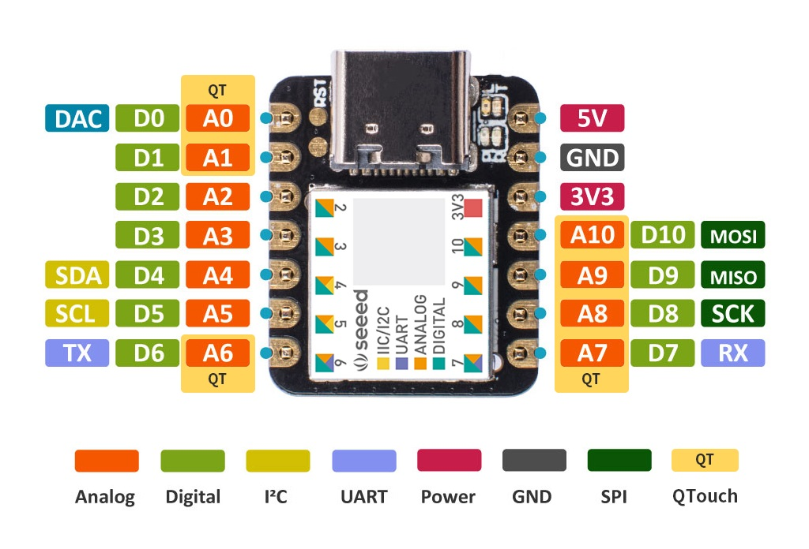

# Pomoduino: The Arduino Pomodoro Timer

Pomoduino is a project aimed at creating a Pomodoro timer using AI-generated content, covering everything from code to documentation. It's designed to run on the Seeeduino XIAO SAMD21 Arduino board.

## Overview

Pomoduino is an Arduino-based Pomodoro timer designed to enhance productivity and time management for individuals working on tasks or projects. Inspired by the Pomodoro Technique developed by Francesco Cirillo in the late 1980s, this project aims to leverage the power of artificial intelligence to provide a customizable and efficient tool for improving focus and productivity. By breaking work into intervals, traditionally 25 minutes in length, separated by short breaks, Pomoduino offers users a structured approach to work while promoting well-being and efficiency.

## Installation

1. **Add Seeeduino Board Definitions File to Arduino IDE**:
   - Open the Arduino IDE.
   - Go to `File` > `Preferences`.
   - In the Preferences window, find the `Additional Board Manager URLs` field.
   - Add the following URL to the field: `https://files.seeedstudio.com/arduino/package_seeeduino_boards_index.json`
   - Click `OK` to save the preferences.
1. **Update VSCode Include Directory for WSL**
   - Add Arduino library path `/mnt/c/Users/Your_Username/Documents/Arduino/libraries/**` to `c_cpp_properties.json`
      - Note: do not escape spaces with a backslash
1. **Restart VSCode**

This will enable the Arduino IDE to access the Seeeduino board definitions for installation and reference the C++ Arduino libraries in VSCode.

## Seeeduino XIAO

Getting Started Guide:  
https://wiki.seeedstudio.com/Seeeduino-XIAO/

